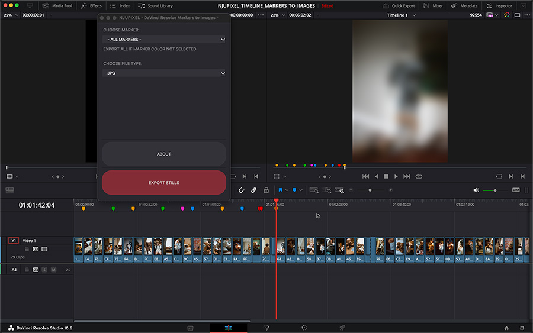
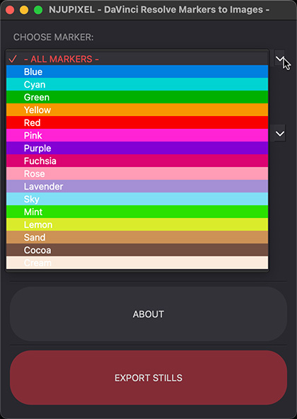
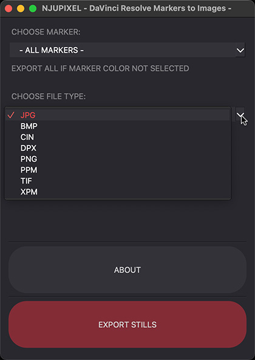

<h1>DaVinci Resolve timeline markers to images exporter. </h1>

<h2>This application allow you to export markers to images files.

 You can choose JPEG, PNG, DPX, TIFF, CIN, PPM, BMP, XPM file type.
</h2>

---

---
<h3>Export file name convention:</h3>

Path Name:

Choose path to export. App will make a folder - {time}_{timeline name}/

File Name:

{clip_name_without_extention}_TC_{timecode}_{marker name}_.{file type}

---

Timecode conversion is made by - "SMPTE timecode conversion module by Igor Ridanovic".

https://github.com/IgorRidanovic/smpte/blob/master/SMPTE.py

---
<h3>Has been tested on :</h3>

- macOS Ventura 13.5 and Windows 10 Pro with Davinci Resolve Studio 18.6 and Python 3.11.4

Script is working with:

- 23.976, 24p, 25p, 30p, 50p, 60p

- 50i, 29.97, 59.94

- DF non DF 

- Test it in your conditions. I mostly work with Pal area project like 25p, 50p and 50i

---
<h3>Requirements:</h3>

Davinci Resolve Studio 18.5, Python >=3.6 , PySide6., SMPTE timecode conversion module

---
<h3>Installation:</h3>

Follow DRS developer readme.txt to setup python path.

Set the environment variables.

>
    Mac OS X:
    RESOLVE_SCRIPT_API="/Library/Application Support/Blackmagic Design/DaVinci Resolve/Developer/Scripting"
    RESOLVE_SCRIPT_LIB="/Applications/DaVinci Resolve/DaVinci Resolve.app/Contents/Libraries/Fusion/fusionscript.so"
    PYTHONPATH="$PYTHONPATH:$RESOLVE_SCRIPT_API/Modules/"

    Windows:
    RESOLVE_SCRIPT_API="%PROGRAMDATA%\Blackmagic Design\DaVinci Resolve\Support\Developer\Scripting"
    RESOLVE_SCRIPT_LIB="C:\Program Files\Blackmagic Design\DaVinci Resolve\fusionscript.dll"
    PYTHONPATH="%PYTHONPATH%;%RESOLVE_SCRIPT_API%\Modules\"
>

Put Script folder to:

>
    Mac OS X:
          - All users: /Library/Application Support/Blackmagic Design/DaVinci Resolve/Fusion/Scripts
          - Specific user:  /Users/<UserName>/Library/Application Support/Blackmagic Design/DaVinci Resolve/Fusion/Scripts

    Windows:
          - All users: %PROGRAMDATA%\Blackmagic Design\DaVinci Resolve\Fusion\Scripts
          - Specific user: %APPDATA%\Roaming\Blackmagic Design\DaVinciResolve\Support\Fusion\Scripts
          and start it from Davinci Workspace\ Scripts.
>

---
<h3>To do:</h3>
    
- user defined name convention

    
- export with grade versions

    
- export with burn-in preset(this will work under DRS >=18.6)

    
- clean code

---
<h3>Known issue:</h3>
    
- Application work from Cut, Edit, Color Page but not from Deliver Page

    
- Playhead must be located on any clip in timeline not outside

    
- Application does not export clip markers - only timeline markers.

---

[☕️ Fuel my coffee mug 😀](https://www.paypal.com/paypalme/njupixel)

NJUPIXEL Maciej Frydrych 2023

njupixel@gmail.com

